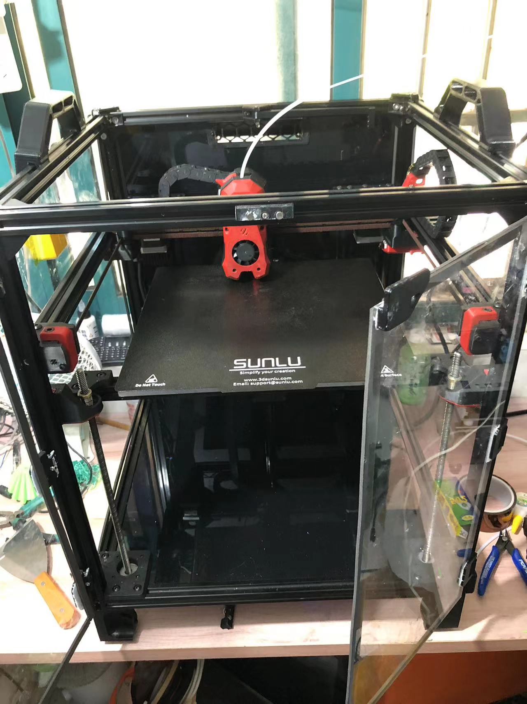

## Hi there 👋

This is my personal readme. Thanks for your reading!

## 🔭 I’m currently working on

- R&D Engineer

## 🌱 I’m currently learning

- Software Architecture
    - Domain-Driven Design (DDD)
    - Cloud Native Computing and Kubernetes
    - Software Supply Chain Security and Compliance
- Open Source
    - History
    - Cases
    - Ideas
- 3D Printing Tecknology
    - 3D Printing tips
    - How to make 3D Printing machine
    - How to make multimaterial systems
- Electronic Diy

## 👯 I’m looking to collaborate on
- [Open Chain Telco Guide](https://github.com/OpenChain-Project/Telco-WG)
- [Wukong Robot](https://github.com/wzpan/wukong-robot)
- [Freedom DDD](https://github.com/8treenet/freedom)

## 🤔 Webinars and conference talks

- [CommunityOverCode Asia 2024 - Bytedance AI Meetup](https://bytedance.larkoffice.com/docx/HOC2dbQOtoUKJ4x99stcEWuRnEd)

## 😄 Pronouns
- He/him/his

## 📫 How to reach me
- Email is most likely the best way

## ⚡ Fun fact
- Tried a lot and failed a lot
- Follow my heart
- Make Every Day Count

## End
> in 2024.

I made my first 3D Printing Machine Voron Trident

