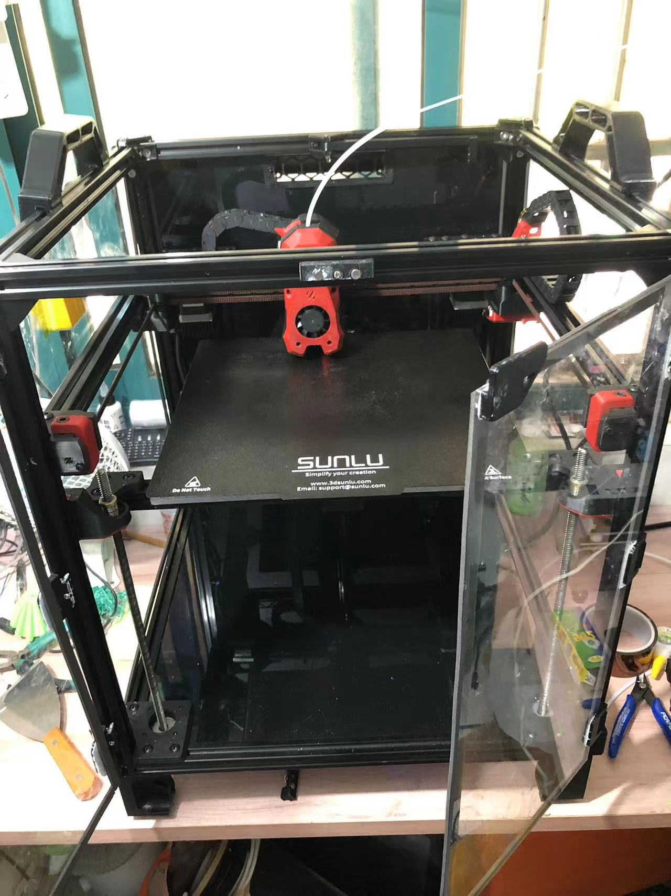

# Hi, I'm Ammend 👋

I am an R&D engineer with 10+ years of experience in large-scale internet and cloud infrastructure. My work sits at the intersection of **DevOps, software supply-chain security, open source, and AI agents**.

I care about turning emerging technology into dependable engineering systems: reproducible agent tools, portable context, secure execution, and open standards that teams can actually adopt. I also speak and write about what I learn, with the goal of helping more people benefit from open technology.

## What I am building now

My current focus is the infrastructure around AI agents—not only model capability, but also how agents collaborate, preserve context, execute safely, and produce reproducible results.

- **[handoffX](https://github.com/ammend/handoffX)** — an open, portable, Markdown-native context handoff protocol for transferring work across AI agents, sessions, owners, platforms, and infrastructure. It includes an installable Agent Skill, a reference CLI, schemas, and multi-receiver negotiation semantics.
- **[ShellLane](https://github.com/ammend/shelllane)** — an identity-aware shell execution router for local, SSH, and container runtimes. It gives AI coding tools isolated user state and policy-controlled execution without requiring vendor-specific adapters.
- **[botmux](https://github.com/deepcoldy/botmux)** — contributing to the bridge between Feishu/Lark and AI coding CLIs. My recent merged contribution added programmatic management of Lark group tabs across the CLI, OpenAPI layer, commands, documentation, and tests ([PR #1388](https://github.com/deepcoldy/botmux/pull/1388)).
- **[CloudWeGo Eino](https://github.com/cloudwego/eino)** — contributing to the Go framework for LLM/AI applications. My recent merged fix made agent-facing in-memory filesystem queries deterministic, improving reproducibility for prompts, snapshots, and caches ([PR #1297](https://github.com/cloudwego/eino/pull/1297)).

## Engineering interests

- AI agent infrastructure: context handoff, multi-agent collaboration, tool execution, memory, and evaluation
- Software architecture: Domain-Driven Design, cloud native systems, Kubernetes, and universal artifact repositories
- Software supply-chain security and compliance: SBOM, SPDX, OpenChain, and practical governance
- Open-source communities, developer education, and public-interest technology
- 3D printing and electronics DIY

## Open source and standards

- **[OpenChain Telco Guide](https://github.com/OpenChain-Project/Telco-WG)** — specification, schema, tooling, and examples for telecom software supply-chain compliance
- **[OpenChain Telco Guide Examples](https://github.com/ammend/openchain-telco-guide-examples)** — practical reference artifacts for implementing the guide
- **[Wukong Robot](https://github.com/wzpan/wukong-robot)** — open-source Chinese voice assistant ecosystem
- **[Freedom DDD](https://github.com/8treenet/freedom)** — a framework for domain-driven, hexagonal architecture

I welcome collaboration around agent interoperability, reproducible AI systems, secure execution, and open-source governance.

## Talks and community work

- [OSPO Summit 2025 — OpenChain SBOM 国际标准落地实践分享](https://mp.weixin.qq.com/s/PJUQaMJo_Uid3K9GC9zk3w)
- [OpenChain Work Group Meetup — OpenChain Telco SBOM Guide: From Specification, Schema, Tool to Example in ByteDance](https://bytedance.larkoffice.com/docx/VWxGdskjuonS01xMmqUcgIWonsc)
- [CommunityOverCode Asia 2024 (ApacheCon) — ByteDance AI Meetup](https://bytedance.larkoffice.com/docx/HOC2dbQOtoUKJ4x99stcEWuRnEd)
- [参与撰写信通院《开源大模型应用指南 1.0》](https://mp.weixin.qq.com/s/lZSMXIXjxxTN79P4Fv8gzA)
- [2024 开源年会 —《3D 打印领域开源协议探索》](https://mp.weixin.qq.com/s/XDLJYV-eHZchYzNRnqXKgQ)
- [“一小陪一老”——培训学生开发陪伴老人的 AI 智能体](https://news.qq.com/rain/a/20250218A0416N00)

## Beyond software

In 2024, I built my first 3D printer, a Voron Trident.

## Contact

- Email is the best way to reach me.
- Pronouns: he/him/his

> Make Every Day Count.
